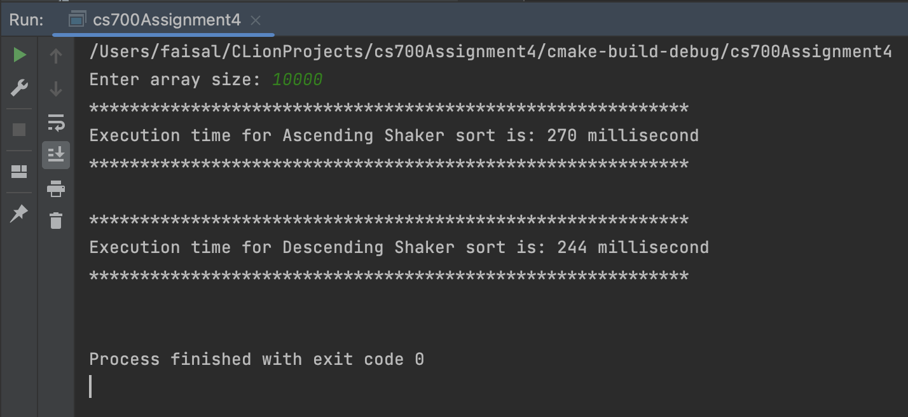
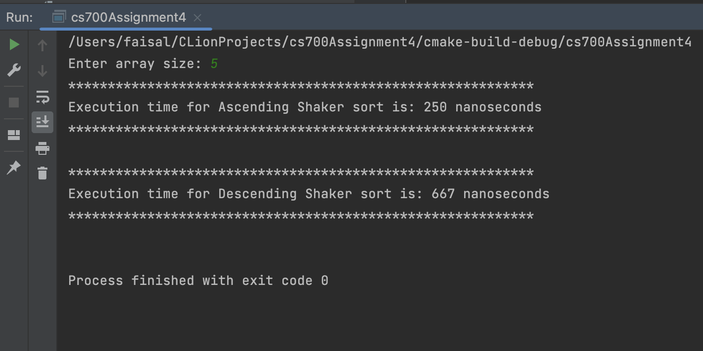
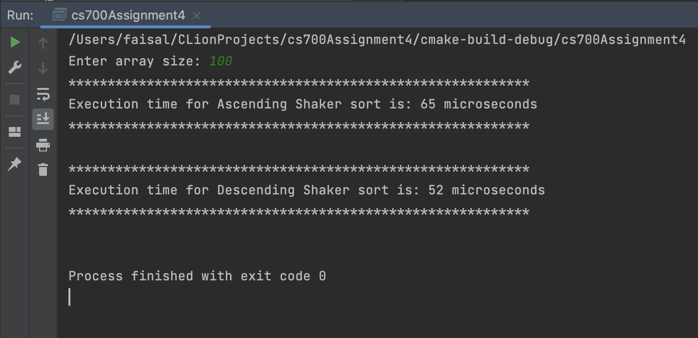
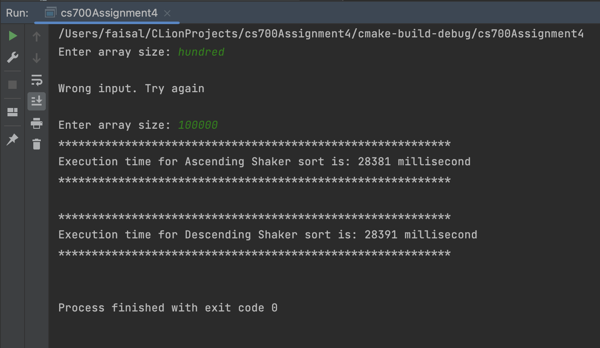

@mainpage

## Getting Started
#### This assignment contains a program to input an array size from user then create a random array of that size and store the array to a file. Then read the array from the file and perform shaker sort (bi-directional bubble sort) in both ascending and descending order and calculate the execution time for both sort and display on the console and store the sorted arrays in each file.

### 1. Main file.
### Contents -
1. [Main CPP File](main.cpp)
### Usage - 
#### Running the main() function the program.
  
### 2. Shaker sort module  - 
#### Contents - 
	i. ShakerSort.h - contains function prototypes and class.
	ii. ShakerSort.cpp - contains functions implementations for the program
### Usage - 
#### This assignment contains a program to input an array size from user then create a random array of that size and store the array to a file. Then read the array from the file and perform shaker sort (bi-directional bubble sort) in both ascending and descending order and calculate the execution time for both sort and display on the console and store the sorted arrays in each file.
### Output - 
1. Console output
      
      
      
      
 
2. Output file
	i. Random array file - [Output txt file](shaker_sort_output.txt)
	ii. Shaker sort ascending file - [Output txt file](shaker_sort_asc.txt)
	iii. Shaker sort descending file - [Output txt file](shaker_sort_desc.txt)

