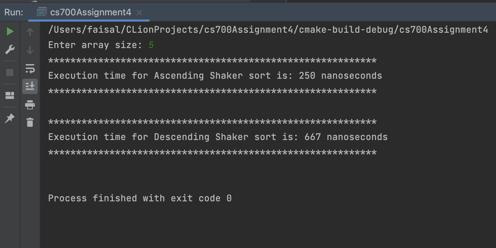

# CS-700 Assignment 4

## Getting Started
#### This assignment contains a program to input an array size from user then create a random array of that size and store the array to a file. Then read the array from the file and perform shaker sort (bi-directional bubble sort) in both ascending and descending order and calculate the execution time for both sort and display on the console and store the sorted arrays in each file.

### 1. Main file.
### Contents -
1. main.cpp
> Usage - 
>> Running the main() function the program.
  
> 2. Shaker sort module  - 
>> Contents - 
	i. ShakerSort.h - contains function prototypes and class.
	ii. ShakerSort.cpp - contains functions implementations for the program
> Usage - 
>> This assignment contains a program to input an array size from user then create a random array of that size and store the array to a file. Then read the array from the file and perform shaker sort (bi-directional bubble sort) in both ascending and descending order and calculate the execution time for both sort and display on the console and store the sorted arrays in each file.
> Output -  
	i. Output 1 - 
    		a.     
		b. [Random array file](output1/shaker_sort_output.txt) 
		c. [Shaker sort ascending file](output1/shaker_sort_asc.txt) 
		d. [Shaker sort descending file](output1/shaker_sort_desc.txt)  
	i. Output 2 -  
    		a.     
		b. [Random array file](output2/shaker_sort_output.txt) 
		c. [Shaker sort ascending file](output2/shaker_sort_asc.txt) 
		d. [Shaker sort descending file](output2/shaker_sort_desc.txt)  
	i. Output 3 -  
    		a.     
		b. [Random array file](output3/shaker_sort_output.txt) 
		c. [Shaker sort ascending file](output3/shaker_sort_asc.txt) 
		d. [Shaker sort descending file](output3/shaker_sort_desc.txt)  
	i. Output 4 -  
    		a.     
		b. [Random array file](output4/shaker_sort_output.txt) 
		c. [Shaker sort ascending file](output4/shaker_sort_asc.txt) 
		d. [Shaker sort descending file](output4/shaker_sort_desc.txt)  
